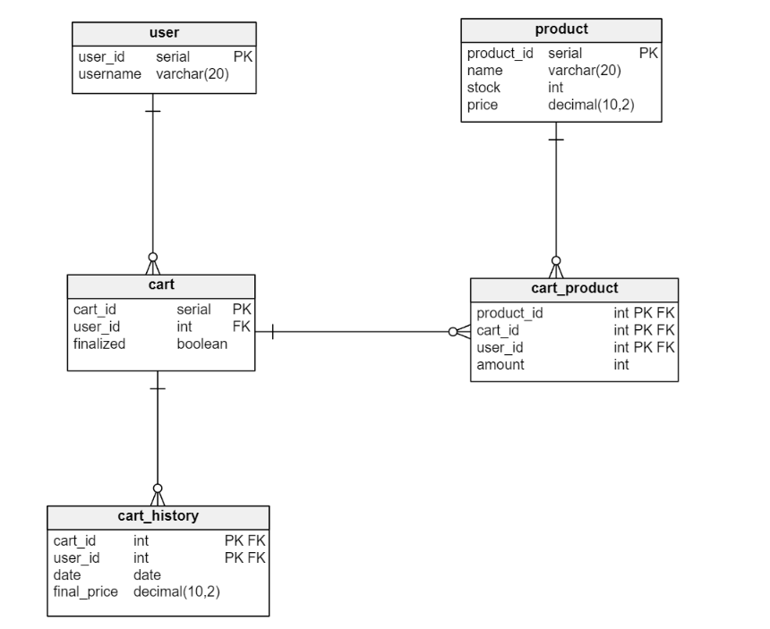

#   Proyecto Final LAMANSYS: Back-end bootcamp
En este proyecto se aplicaron los conocimientos adquiridos a lo largo del curso mediante la simulación de un escenario real.
Este escenario consiste de un sistema de comercio electrónico, para el cual fue desarrollado el back-end
que permite proveer distintos servicios relacionados al carrito de compras del mismo.
Se creó una API que permite crear un carrito de compras, agregar y eliminar productos al carrito de compra,
calcular el precio total del carrito de compra y finalizar la compra de un carrito. 

*Creación de módulo y configuración de proyecto*
---
Siguiendo las indicaciones que se encontraban en el README y en las convenciones de la presentación,
se creó un modulo específico para la funcionalidad requerida.
Este módulo cuenta con su propio pom.xml, donde se encuentran todas las dependencias necesarias para que corra correctamente.

En cuanto a la configuración del proyecto, se esableció una arquitectura hexagonal como modelo a seguir a lo largo del desarrollo. Es por ello que el proyecto cuenta con 3 capas: infraestructura, aplicación y dominio.
- La capa de infraestructura permite que la aplicación se comunique con componentes externos. Esto incluye los adaptadores para la BDD Y adaptadores de red.
- La capa de aplicación incluye los casos de uso, servicios de aplicación y otros componentes que cumplen las operaciones específicas de la aplicación.
- La capa de dominio contiene la lógica de negocio central de la aplicación. Acá fueron definidios los bussines-object de nuestra aplicación.

*Base de Datos* 
---
Para el diseño de esta API, inicialmente se planteó el diseño de la BDD, la cual se conecta con la salida de nuestra capa de infraestructura. 
Según el problema planteado, el diagrama de entidad-relación quedó de la siguiente manera:

- La tabla 'cart' registra todos los carritos que fueron creados por distintos usuarios, donde siempre habrá como máximo un carrito activo (donde finalized = false)
- La tabala 'cart_product' registra todos los productos que fueron agregados a distintos carritos con su cantidad.
- La tabla 'cart_history' registra únicamente aquellos carritos que ya fueron finalizados (todos los que en la tabla 'cart' cuentan con finalized = true), junto con la fecha y el monto total que costó la suma de todos sus productos.


*Endpoints*
==
A continuación, se hará una explicación de los distintos endpoints que fueron solicitados en esta entrega. 
Estos endpoints permiten realizar operaciones ABM del carrito de compras utilizando distintos servicios creados dentro de nuestra aplicación.

Primeramente, se hará una breve explicación del funcionamiento de los servicios utilizados por los endpoints:
- ```FindUserService:```Busca un usuario por su user_id, en caso de no encontrarlo lanza la excepción ```UserDoesNotExistException ``` 
- ```FindProductService:```Busca un producto por su product_id, en caso de no encontrarlo lanza la excepción ```ProductDoesNotExistException ```
- ```CheckStockService:``` Recibe una cantidad solicitada de un producto para agregar a un carrito, y chequea si se cuenta con el stock necesario. En caso de no hacerlo, lanza la excepcion ```StockNotAvailableException```
- ```UpdateStockService:``` Solo es utilizado cuando se finaliza una compra. Recibe la cantidad a comprar y actualiza el stock. En caso de no ser sufficiente, lanza la excepcion ```StockNotAvailableException```
- ```GetCartProductsService:``` Recibe un user_id, y devuelve un listado de los productos que se encuentran en su carrito activo.

Cada uno de estos endpoints a su vez cuenta con 2 tests de unidad cada uno, para verificar que cada uno de ellos
haga las operaciones esperadas al momento de ser llamados por el usuario.
---
*Agregar productos y crear un carrito*
--
```POST/cart/{userId}```

Se decidió unir los endpoints de agregar producto y crear un carrito en uno solo para no permitir crear carritos sin productos. Por cada operación exitosa de este endpoint se creará una nueva entidad CartProduct, y en caso de que no exista previamente el carrito también se creará una entidad Cart.

Utiliza los servicios FindUserService,FindProductService,CheckProductStockService, así como también los servicios de guardar un carrito y un producto de carrito. 
- Request: Crea un nuevo producto de carrito (CartProduct) con la información proporcionada (product_id,cantidad) y lo agrega al carrito del usuario indicado. En caso de que 
no exista ningún carrito activo para el usuario, se crea uno nuevo y se agrega el producto.
```
{
    "product_id:" 1
    "amount:" 10
}
```
- Response: 
  - Retorna un código de estado 200 OK en caso de que todos los datos ingresados cumplan con los chequeos.
  - Retorna un código de estado 404 NOT FOUND junto con la excepción correspondiente, en caso de que no exista el usuario o el producto indicados.
  - Retorna un código de estado 400 BAD REQUEST junto con la excepción StockNotAvailable en caso de no contar con el stock suficiente del producto indicado.
---
*Ver un carrito*
---
```GET/cart/{userId}```

Obtiene la información de un carrito junto con los productos que lo componen.

Utiliza el servicio GetCartProductsService únicamente, ya que la búsqueda del carrito se realiza a través del propio puerto.
- Request: Obtiene información sobre un usuario específico identificado por user_id.
```
/cart/1
```
- Response:
  - Retorna un código de estado 200 OK junto con el user_id, cart_id, y el listado de productos junto con su cantidad.
    ```
    {
        "user_id:" 1
        "cart_id:" 3
        "products:" 
        [
            [
                "product_id:" 1
                "amount:" 10
            ]
            [
                "product_id:" 2
                "amount:" 3
            ]
        ]
    }
    ```
  - Retorna un código de estado 404 NOT FOUND junto con la excepción CartDoesNotExistException en caso de que el usuario no cuente con un carrito activo.
---

*Eliminar productos de un carrito*
---
```DELETE/cart/{userId}/{productId}```

Elimina un producto de un carrito activo de un usuario. Se utiliza únicamente el user_id ya que los usuarios pueden tener un único carrito activo.
Por cada operación exitósa se eliminará una entidad CartProduct

- Request: Elimina un producto específico de carrito identificado por user_id y product_id.
```
/cart/1/2
```
- Response: 
  - Retorna un código de estado 200 OK si la eliminación se realiza con éxito.
  - Retorna un código de estado 404 NOT FOUND junto con la excepcion CartProductDoesNotExist en caso de que el carrito no contenga ese producto.
  - Retorna un código de estado 404 NOT FOUND junto con la excepción CartDoesNotExistException en caso de que el usuario no cuente con un carrito activo.

---
**Calcular monto de carrito**
---
```GET/cart/montoTotal/{userId}```

Calcula y devuelve el monto total a pagar por un carrito de compras.

- Request: Obtiene información de un usuario específico identificado por user_id.
```
/cart/montoTotal/1
```
- Response:
  - Retorna un código de estado 200 OK junto con el user_id, cart_id,el listado de productos junto con su cantidad, y el monto total a pagar.
    ```
    {
        "user_id:" 1
        "cart_id:" 3
        "products:" 
        [
            [
                "product_id:" 1
                "amount:" 10
            ]
            [
                "product_id:" 2
                "amount:" 3
            ]
        ]
        "final_price:" 1200.50
    }
    ```
  - Retorna un código de estado 404 NOT FOUND junto con la excepción CartDoesNotExistException en caso de que el usuario no cuente con un carrito activo.
---
**Finalizar Compra**
---
```PUT/cart/finish/{userId}```

Finaliza la compra de un carrito. Establece el carrito como finalizado y guarda la fecha y monto total a pa gar cuando fue finalizado.

- Request: Obtiene información de un usuario específico identificado por user_id. Con esto identifica el carrito activo. A su vez, crea una nueva entidad de CartHistory y actualiza el stock de los distintos productos.
```
/cart/finish/1
```
- Response:
    - Retorna un código de estado 200 OK si la operación fue realizada con éxito.
    - Retorna un código de estado 404 NOT FOUND junto con la excepción CartDoesNotExistException en caso de que el usuario no cuente con un carrito activo.
    - Retorna un código de estado 400 BAD REQUEST unto con la excepción StockNotAvailable en caso de no contar con el stock suficiente de alguno de los productos del carrito.
---

Conclusión personal del bootcamp
---

Finalmente, quería realizar una devolución a Anibal y Francisco y agradecerles por el tiempo que se tomaron en enseñarnos todas estas prácticas.
Realmente me sorprendió lo mucho que se pudo explicar y aprender en poco más de dos meses.

Aprendí acerca de varias herramientas y de protocolos que siguen las empresas día a día para mantener un orden y un seguimiento de sus proyectos. Me pone muy contento
encontrarle utilidad a todo lo que aprendí, ya que con esta entrega y con la anterior (grupal) pude poner en práctica todos los conocimientos
que había adquirido previamente en las clases teóricas.

También quiero destacar que este bootcamp me enseñó a trabajar correctamente  en equipo, diviendonos y asignando las tareas 
entre mis distintos compáñeros y yo, para cumplir con un objetivo de la manera más organizada y eficiente posible.

Gracias a la ayuda de profesores, compañeros y la internte pude profundizar aún más mi conocimiento acerca de las funcionalidades
que nos fueron enseñando,y realmente me siento muy cómodo con el manejo de las mismas. Obviamente han surgido ciertos problemas, pero justamente 
fueron los que me hicieron aprender aún más.


